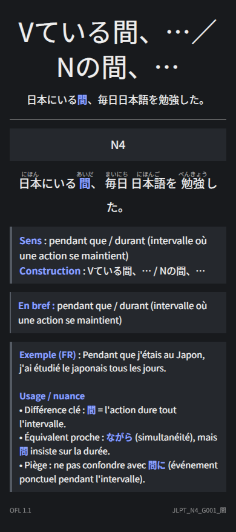
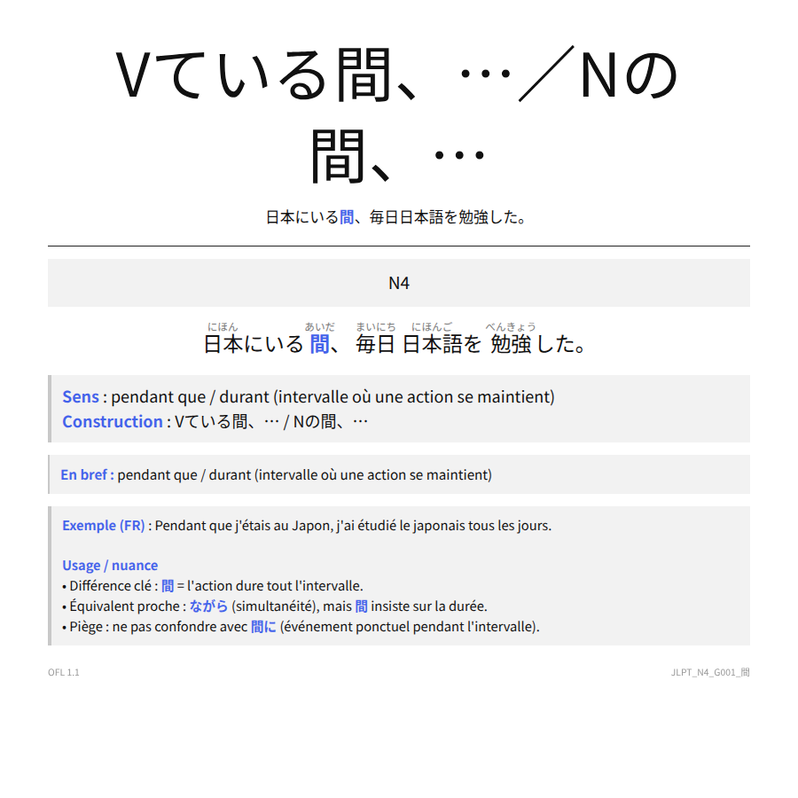

# Grammaire japonaise JLPT - Français

Deck Anki de 831 fiches de grammaire japonaise du JLPT N5 à N1 pour francophones.

Exemples :

## Contenu

- 831 fiches du JLPT N5 au N1
- exemples japonais avec furigana
- explications et nuances en français
- affichage clair, sombre et mobile
- police Noto Sans JP intégrée
- aucun add-on requis

## Installation

1. Téléchargez `Grammaire_japonaise_JLPT_FR.apkg`.
2. Ouvrez le fichier avec Anki.
3. Confirmez l'importation du deck.

## Licence

Noto Sans JP est distribuée sous SIL Open Font License 1.1.
